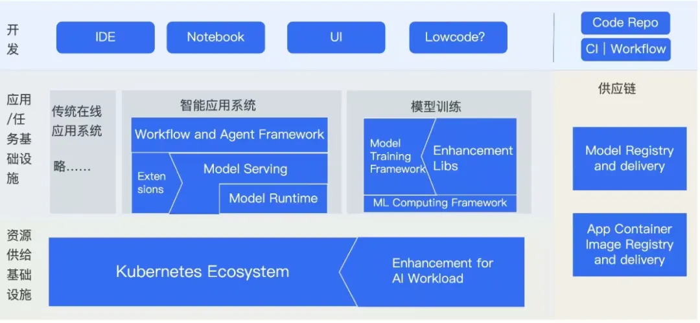
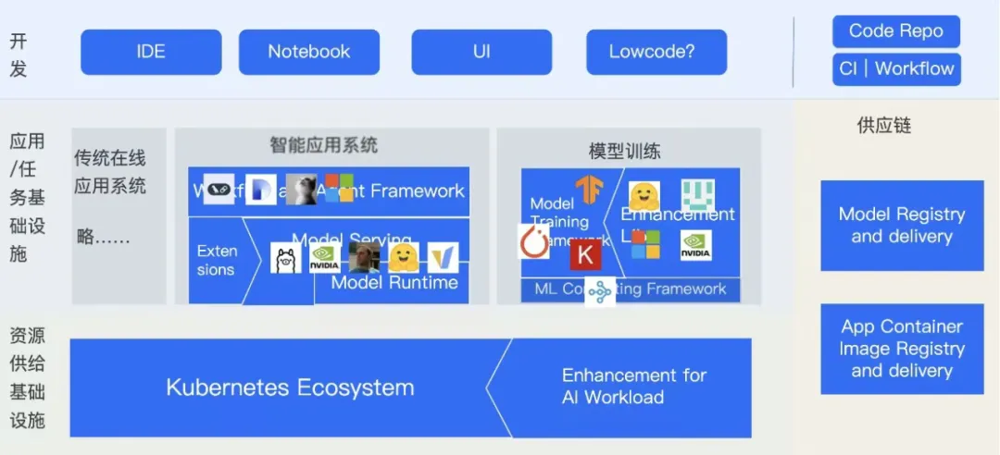
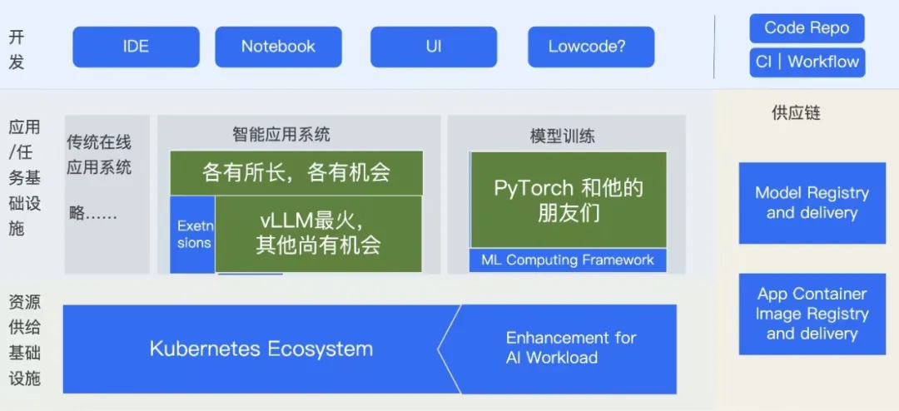

import TabItem from '@theme/TabItem';
import Tabs from '@theme/Tabs';
import OpenDiggerLineChart from '@site/src/components/OpenDiggerLineChart';
import SimpleECharts from '@site/src/components/SimpleECharts';
import SimpleTable from '@site/src/components/SimpleTable';
import YayaChart from '@site/src/components/YayaChart';
import { MetricCategory, RepositoryMetricType, TimeUnit } from '@site/src/types/opendigger';

import MiscChartsTab from './_tabs/miscCharts.mdx';
import NetworkChartsTab from './_tabs/networkCharts.mdx';
import TrendsChartsTab from './_tabs/trendsCharts.mdx';

# 2024-10 QCon Shanghai

> 作者：王旭、小雅
> ### 写在前面
> 10 月 19 日，我和小雅在 QCon 全球软件开发大会 2024（上海站）「开源重塑 AI 开发生态」专题作了题为「从社区数据看大模型开发生态的全景与趋势」的演讲，
作为该专题的出品人，两届“ QCon 优秀出品人”得主的 “老人”，为什么在出品的同时要兼做这个演讲？
是因为在这个主题之下，我自己也产生了困惑——开源生态到底发生了什么变化，我们又该从中学到点什么。这个演讲只是一个开始，后续还有继续的研究正在进行中。

### 破题：为什么要看社区

毫无疑问，我们每个人都或多或少地感知到大模型带给我们的冲击，然而，当我们看着充斥在眼前的信息，对训练和推理的需求疲于奔命的时候，什么是趋势，全景如何，破局点在哪里，应该放弃什么或是追逐什么，对每一个疲惫但仍心存未来的开发者来说，都是想弄清的问题之一，对我也不例外。

但是，当我**作为架构师**，尝试从现有系统、现有组织里来提取系统发生了什么变化的时候，看到的却是在被巩固的边界，和原有系统的延伸。不管它是不是有问题，边界和架构却都有发生什么变化，在面临破坏性（disruptive）变革的时候，这不是生态该有的演进方式，但是，已有的组织，从自己的出发点来看，又是那么地必然。

于是，我想起来，我还是一个开源世界的小分子。当我作为**开源参与者**，我看到了涌现的新项目，尤其是 llama2 发布之后大批涌现的项目，以及已有项目的转向，乃至很多项目的沉寂，开源世界是一个或很多自治的生态系统，这个系统的自底向下的演变，正是可以给我们一些输入，让我们审视——昨日明星今何在，生态全景又如何，关键锁钥入谁手，我欲入局做哪家。

刚好啊，我说刚好啊，我们开源办的同学们在很早就开始了数据上的研究和合作，我们还有小雅这样的研究了几年社区的博士同学，于是，我请来小雅一起做这个分析，一拍即合。当然啊，因为我们这个分析还在进行中，QCon 只是给大家一点点预览，后面还需要有更多工作。

不过，虽然还没有最终版，但做**架构师就是要敢于下断言**，我先说一个总体的想法：

**生态是本无所谓有，无所谓无的。正如这些公共接口；其实项目之间本没有公共接口，重复造的轮子多了，也便成了接口。——鲁迅《故乡》（王旭微调版）**

### 我们看到的开源 AI 生态

首先我做一个免责声明：社区的行为数据只反映一部分的社区关系，既不全面，也不充分，并不被视为是对项目本身「好坏」的公平评价，我们只是以此来提供一些参考信息。

那么我们拿到了什么社区数据呢：

- 首先，我们有项目本身的活动数据，比如 commit, PR, Issue 以及它们的 comments 的数量、频率、分布情况等等；
- 其次，通过共同参与项目的人，我们还有这些项目之间的关联信息，比如一个人对两个项目都有贡献；
- 或者，对两个项目都做了 Star/Fork（当然这个数据我们实际没有记入，如果确实有贡献，Fork 就是 PR 的前置动作，反过来，单纯的 Star/Fork 产生的信息量还不太够看作是社区行为）。
- 最后，虽然我们还没收入的，但是 GitHub 的部分项目提供了 SPDX 标准兼容的 Dependency 数据。

同时，我们假设项目之间会有什么关系呢，我认为，在构建一张生态全景图的时候，至少有这么几种关系：

- 代码或执行依赖性：比如我依赖了数学库来做矩阵运算，依赖了网络库来做通信，当在这些库身上遇到问题的时候，我可能会去寻求解决（issue），甚至是去提 PR，如果是老用户，那么我可能会帮其他用户解决他们的 issue 或审阅它们的 PR；
- 项目之间的上下游合作关系：考虑到一个应用的工作流，比如从终端到 Web 服务和应用，再到中间件，最后到数据库，这样的前后连接协作，对于彼此的协作和分工，如果产生了彼此的需求，那么会去提出自己的功能需求，甚至是增加自己的扩展，比如我们做容器运行时，会去改或扩展 containerd，就是这样的上下游关系，反过来 containerd 也会来要求我们这样做或不这样做，互动就出来了；
- 另一种关系是同生态位的替换 / 竞争关系：这个很容易理解，比如 OB 替换 Oracle，它们在系统中位置完全相同，彼此穷则划江而治，达则一统江湖，当然也有不这么明显的，或者说，正在演进中的，比如用图数据库替换关系数据库，那上下游也需要一些变化。
- 综上，这些依赖性和合作关系就构成了一张张应用架构图，但只有在重复的位置上不断产生了替换竞争关系，在不同位置之间产生了逐渐被公认的接口，这才说明一个生态位在清晰起来，进而描绘出来了一个生态的大图，这就是我前面说的那句话——“生态是本无所谓有，无所谓无的。正如这些公共接口；其实项目之间本没有公共接口，重复造的轮子多了，也便成了接口。”

基于上面的这些假设，我请小雅做了如下的一些图。

<Tabs>
  <TabItem value="network" label="Network Charts" default>
    <NetworkChartsTab />
  </TabItem>
  <TabItem value="trends" label="Trends Charts">
    <TrendsChartsTab />
  </TabItem>
  <TabItem value="misc" label="Misc Charts">
    <MiscChartsTab />
  </TabItem>
</Tabs>

### 一张生态全景图
#### 已经有的全景图
依照上述的关系，我们要来绘制一张全景图，但是明明已经有了 LF AI and Data 的全景图，CNCF 旗下的 CNAI 全景图等，我们画的图是否还有一席之地呢。我的理解是这样的，LF 旗下，包括 CNCF 的全景图，是给生态项目的一个定位自己、宣传自己的广告牌，其中的生态位的排布是有很强的参考价值的，我也参考了，但是项目的位置却是由项目自己提交的，其中的广告目的也会让它有点迷眼，而我们的社区行为数据在这里，是一份可观但不全面的数据，我们在绘图的时候，使用的是客观的数据，以及不可避免的我们自己的态度，兼听则明，并不是说哪个一定好，更不是说我没有看其他的图，这里希望能给各位一个参考。

#### 一些前置定义
如上面“开源生态”部分描述的项目之间的关系，生态之中至少有这么几条不同的线索：

- 开发链：以代码输入为起点，直到代码进入仓库，这个过程中可能有各种工具的掺入，常见的包括代码生成与辅助、测试与集成；而今，随着所谓 GenAI 的流行，越来越多的工具开始“有了~~（智障的）~~灵魂”，因此这一链条正在逐渐变得重要；
- 供应链：以代码仓库以及相关的数据存储为起点，直到把要执行的二进制送到它的执行点上被运行，涉及到了存储、索引、生命周期、传输与分发等，一般的大图里，这个部分是画成一个横向的连通功能或者是旁边的辅助位置；
- 执行链：这条链条常常是 SRE 或为 SRE 提供的基础设施最关心的，从部署任务的产生，到编排与调度，到执行点上的运行时和运行软件栈，这一条链在一般大图上是纵向线；此外上述**供应链和执行链会在“运行时”这个位置交汇在一起**；
- 工作流：这条链比较复杂，软件跑起来之后，这条链是前后串起来的数据流 / 调用流，这条链在一般大图上有点复杂，有的时候是并列的，比如不同的服务，有的时候是上下部署的，比如前后端、数据库服务等，也有的时候会画在一边，比如接入网关、端侧等。

可以看到，这四条链条（它甚至不是全的，比如可观测相关的监控、日志等都没在里面），它并不是二维平面图，这给我们画图带来了一定的麻烦，我们至少要自己能理解到这些关系，才能更好地理解一个生态。

### 生态中的生态位

生态位概览：

把一些核心项目投放到生态位上：

### 写在本文最后，但还没有完

回到上面的架构图上，我们可以看到，一些主要的领域里的一些大趋势似乎已经挺明显了。

这里有一些简单的观察：

- 大模型开发的范式正在形成，有点类似 20 年前的 LAMP，做应用，或是做 LAMP （平台、基础设施）本身是留给参与者的问题；
- 对于做自己的项目的人，最好能利用上一个好的生态位，或是和中心生态位产生良好互动；

到目前为止，在具体的生态里，可能还会有二级子生态，这里还没有做完整的分析；并且，其实我们还没有完全利用好 GitHub 提供的一些如 dependency 之类的额外信息、社区数据中的一些有向性信息等，因此我们也会继续来做更多的分析和观察。这里，我们发出来这个阶段性的结果，来供大家参考，也启发大家的思考。
