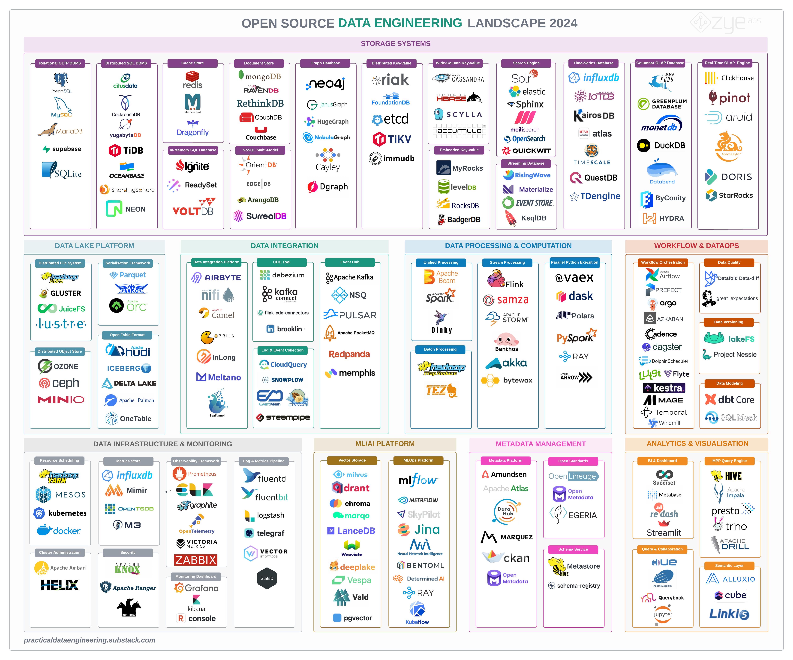

import TabItem from '@theme/TabItem';
import Tabs from '@theme/Tabs';

import OpenDiggerLineChart from '@site/src/components/OpenDiggerLineChart';
import SimpleECharts from '@site/src/components/SimpleECharts';
import SimpleTable from '@site/src/components/SimpleTable';
import YayaChart from '@site/src/components/YayaChart';
import { MetricCategory, RepositoryMetricType, TimeUnit } from '@site/src/types/opendigger';
import {
  Data4AICorrelationChartFull,
  TableFormatCorrelationChart,
  DataEngineeringLandscapeCorrelationChart,
} from './_charts/AIEcosystemCorrelationCharts';

# 2024-11 Data & AI

先从一张优秀的大数据领域全景图说起，这是 Alireza Sadeghi 在 24 年 2 月发布的开源数据工程领域的全景图，在 [GitHub](https://github.com/pracdata/awesome-open-source-data-engineering) 上持续维护。这张图主要分为三层，底层为存储系统，中间层包括了数仓、数据集成、处理、计算和运维，上层为数据的监控、管理、分析和可视化。

大数据作为 AI 三驾马车之一，这张全景图中的每一层，都能或多或少地感知到 Data for AI 的趋势转向，其中一些项目，即是大数据领域的热门项目，也是 AI 领域的热门项目。
而 Table Format、Unity Catalog、Vector Storage 这些数据领域，可以说是在大模型时代下面向 AI 的新兴趋势。

<SimpleTable title={'三年大数据技术项目 Top 20'} data={
 [{"__index__":1,"2022":"elastic/kibana", "2023":"elastic/kibana", "2024":"elastic/kibana"},
 {"__index__":2,"2022":"grafana/grafana", "2023":"grafana/grafana", "2024":"grafana/grafana"},
 {"__index__":3,"2022":"kubernetes/kubernetes", "2023":"kubernetes/kubernetes", "2024":"ClickHouse/ClickHouse", "rankdelta24": 1},
 {"__index__":4,"2022":"ClickHouse/ClickHouse", "2023":"ClickHouse/ClickHouse", "2024":"apache/doris", "rankdelta24": 2 },
 {"__index__":5,"2022":"airbytehq/airbyte", "2023":"airbytehq/airbyte", "2024":"kubernetes/kubernetes",  "rankdelta24": -2},
 {"__index__":6,"2022":"cockroachdb/cockroach", "2023":"apache/doris", "2024":"elastic/elasticsearch",  "rankdelta24": 3, "rankdelta23": 7 },
 {"__index__":7,"2022":"ray-project/ray", "2023":"ray-project/ray", "2024":"airbytehq/airbyte", "rankdelta24": -2 },
 {"__index__":8,"2022":"elastic/elasticsearch", "2023":"cockroachdb/cockroach", "2024":"ceph/ceph",  "rankdelta24": 3, "rankdelta23": -2},
 {"__index__":9,"2022":"ceph/ceph", "2023":"elastic/elasticsearch", "2024":"apache/airflow",  "rankdelta24": 1, "rankdelta23": -1},
 {"__index__":10,"2022":"apache/airflow", "2023":"apache/airflow", "2024":"metabase/metabase", "rankdelta24": 6},
 {"__index__":11,"2022":"trinodb/trino", "2023":"ceph/ceph", "2024":"ray-project/ray", "rankdelta24": -4, "rankdelta23": -2},
 {"__index__":12,"2022":"apache/spark", "2023":"apache/spark", "2024":"cockroachdb/cockroach", "rankdelta24": -4},
 {"__index__":13,"2022":"apache/doris", "2023":"trinodb/trino", "2024":"apache/spark", "rankdelta24": -1, "rankdelta23": -2},
 {"__index__":14,"2022":"apache/flink", "2023":"supabase/supabase", "2024":"supabase/supabase", "rankdelta23": "-"},
 {"__index__":15,"2022":"pingcap/tidb", "2023":"yugabyte/yugabyte-db", "2024":"pola-rs/polars", "rankdelta24": 3, "rankdelta23": 2},
 {"__index__":16,"2022":"apache/beam", "2023":"metabase/metabase", "2024":"dagster-io/dagster", "rankdelta24": "-", "rankdelta23": "-"},
 {"__index__":17,"2022":"yugabyte/yugabyte-db", "2023":"pingcap/tidb", "2024":"apache/kafka", "rankdelta24": "-", "rankdelta23": -2},
 {"__index__":18,"2022":"apache/superset", "2023":"pola-rs/polars", "2024":"trinodb/trino", "rankdelta24": -5, "rankdelta23": "-"},
 {"__index__":19,"2022":"apache/hudi", "2023":"apache/hudi", "2024":"milvus-io/milvus", "rankdelta24": "-"},
 {"__index__":20,"2022":"apache/pulsar", "2023":"apache/beam", "2024":"opensearch-project/OpenSearch", "rankdelta24": "-", "rankdelta23": -4}]
  }
  options={
  [
    {name: '2022', type: 'String', fields: ['2022'], width: 500 },
    {name: '2023', type: 'String', fields: ['2023'], width: 500 },
    {name: 'Rank', type: 'NumberWithDelta', fields: ["__index__", "rankdelta23"], width: 500 },
    {name: '2024', type: 'String', fields: ['2024'], width: 500 },
    {name: 'Rank', type: 'NumberWithDelta', fields: ["__index__", "rankdelta24"], width: 500 },
  ]
}
/>

## 项目关联网络
下图选取了 10 个顶尖的大数据项目为种子节点，通过共同开发者向外寻找开源项目，构建一个项目关联网络，其中节点和边的过滤值都是 40。

<YayaChart
    title= "Data4AI 项目关联网络"
    chart={<Data4AICorrelationChartFull />}
/>

下图为 Open Source Data Engineering Landscape 2024 中的项目之间的关联生态网络，其中节点和边的过滤值都是 10。

<YayaChart
    title= "Data Engineering Landscape 项目关联网络"
    chart={<DataEngineeringLandscapeCorrelationChart />}
/>

## 项目发展趋势对比

### 1. Table Format

<OpenDiggerLineChart
  type={[MetricCategory.REPOSITORY, RepositoryMetricType.OPENRANK]}
  names={['delta-io/delta', 'apache/iceberg', 'apache/hudi', 'apache/paimon']}
  timeUnit={TimeUnit.QUARTER}
/>

### 2.Search Engine

<OpenDiggerLineChart
  type={[MetricCategory.REPOSITORY, RepositoryMetricType.OPENRANK]}
  names={['apache/solr', 'elastic/elasticsearch', 'sphinxsearch/sphinx', 'meilisearch/meilisearch', 'opensearch-project/OpenSearch', 'quickwit-oss/quickwit','paradedb/paradedb']}
  timeUnit={TimeUnit.MONTH}
  timeSpan={['2022-11','2024-11']}
/>

#### OpenSearch & ElasticSearch 贡献厂商对比

OpenSearch 2024 厂商贡献度 Top 100 分布
<SimpleECharts divStyle={{ height: '300px' }} option={{
  series: [{
    type: 'pie',
    data: [{value:395,name:'AWS/Amazon'},{value:83,name:'Avien'},{value:4.2,name:'IIT Kharagpurb'},{value:2.8,name:'OPPSCIENCE'},{value:2.3,name:'NetApp'}, {value:2.2,name:'Mountain Fog'}, {value:2.1,name:'UniqueStudio'}, {value:2.0,name:'ByteDance'}, {value:1.9,name:'NAVER'}, {value:1.9,name:'Bunjang Korea'}, {value:95,name:'Unknown'}, ]
  }]
}}
/>

ElasticSearch 2024 厂商贡献度 Top 100 分布
<SimpleECharts divStyle={{ height: '300px' }} option={{
  series: [{
    type: 'pie',
    data: [{value:1183,name:'Elastic'},{value:33,name:'Apache'},{value:5,name:'Brandwatch'},{value:440,name:'Unknown'}]
  }]
}}
/>

### 3. Vector Storage
<OpenDiggerLineChart
  type={[MetricCategory.REPOSITORY, RepositoryMetricType.OPENRANK]}
  names={['milvus-io/milvus', 'qdrant/qdrant', 'chroma-core/chroma', 'marqo-ai/marqo', 'lancedb/lancedb', 'weaviate/weaviate', 'activeloopai/deeplake', 'vespa-engine/vespa', 'vdaas/vald' , 'pgvector/pgvector']}
  timeUnit={TimeUnit.QUARTER}
  timeSpan={['2016Q2','2024Q3']}
/>

### 4. Metadata Management (Catalog)
<OpenDiggerLineChart
  type={[MetricCategory.REPOSITORY, RepositoryMetricType.OPENRANK]}
  names={['unitycatalog/unitycatalog', 'datahub-project/datahub', 'open-metadata/OpenMetadata', 'apache/polaris', 'lakekeeper/lakekeeper', 'confluentinc/schema-registry','apache/gravitino']}
  timeUnit={TimeUnit.QUARTER}
  timeSpan={['2015Q1','2024Q3']}
/>

<OpenDiggerLineChart
  type={[MetricCategory.REPOSITORY, RepositoryMetricType.OPENRANK]}
  names={['unitycatalog/unitycatalog', 'datahub-project/datahub', 'open-metadata/OpenMetadata', 'apache/polaris', 'lakekeeper/lakekeeper', 'confluentinc/schema-registry','apache/gravitino']}
  timeUnit={TimeUnit.MONTH}
  timeSpan={['2022-11','2024-11']}
/>

### 5. Graph Database

<OpenDiggerLineChart
  type={[MetricCategory.REPOSITORY, RepositoryMetricType.OPENRANK]}
  names={['TuGraph-family/tugraph-db', 'neo4j/neo4j','vesoft-inc/nebula','JanusGraph/janusgraph']}
  timeUnit={TimeUnit.MONTH}
  timeSpan={['2019-11','2024-11']}
/>

<OpenDiggerLineChart
  type={[MetricCategory.REPOSITORY, RepositoryMetricType.OPENRANK]}
  names={['TuGraph-family/tugraph-db', 'neo4j/neo4j','vesoft-inc/nebula','JanusGraph/janusgraph']}
  timeUnit={TimeUnit.QUARTER}
  timeSpan={['2022','2025']}
/>
